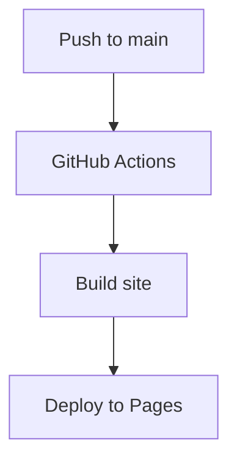

Lorem ipsum dolor sit amet, consectetur adipiscing elit, sed do eiusmod tempor incididunt ut labore et dolore magna aliqua. Vitae ultricies leo integer malesuada nunc vel risus commodo viverra. Adipiscing enim eu turpis egestas pretium. Euismod elementum nisi quis eleifend quam adipiscing. In hac habitasse platea dictumst vestibulum. Sagittis purus sit amet volutpat. Netus et malesuada fames ac turpis egestas. Eget magna fermentum iaculis eu non diam phasellus vestibulum lorem. Varius sit amet mattis vulputate enim. Habitasse platea dictumst quisque sagittis. Integer quis auctor elit sed vulputate mi. Dictumst quisque sagittis purus sit amet.

Morbi tristique senectus et netus. Id semper risus in hendrerit gravida rutrum quisque non tellus. Habitasse platea dictumst quisque sagittis purus sit amet. Tellus molestie nunc non blandit massa. Cursus vitae congue mauris rhoncus. Accumsan tortor posuere ac ut. Fringilla urna porttitor rhoncus dolor. Elit ullamcorper dignissim cras tincidunt lobortis. In cursus turpis massa tincidunt dui ut ornare lectus. Integer feugiat scelerisque varius morbi enim nunc. Bibendum neque egestas congue quisque egestas diam. Cras ornare arcu dui vivamus arcu felis bibendum. Dignissim suspendisse in est ante in nibh mauris. Sed tempus urna et pharetra pharetra massa massa ultricies mi.

Mollis nunc sed id semper risus in. Convallis a cras semper auctor neque. Diam sit amet nisl suscipit. Lacus viverra vitae congue eu consequat ac felis donec. Egestas integer eget aliquet nibh praesent tristique magna sit amet. Eget magna fermentum iaculis eu non diam. In vitae turpis massa sed elementum. Tristique et egestas quis ipsum suspendisse ultrices. Eget lorem dolor sed viverra ipsum. Vel turpis nunc eget lorem dolor sed viverra. Posuere ac ut consequat semper viverra nam. Laoreet suspendisse interdum consectetur libero id faucibus. Diam phasellus vestibulum lorem sed risus ultricies tristique. Rhoncus dolor purus non enim praesent elementum facilisis. Ultrices tincidunt arcu non sodales neque. Tempus egestas sed sed risus pretium quam vulputate. Viverra suspendisse potenti nullam ac tortor vitae purus faucibus ornare. Fringilla urna porttitor rhoncus dolor purus non. Amet dictum sit amet justo donec enim.

Mattis ullamcorper velit sed ullamcorper morbi tincidunt. Tortor posuere ac ut consequat semper viverra. Tellus mauris a diam maecenas sed enim ut sem viverra. Venenatis urna cursus eget nunc scelerisque viverra mauris in. Arcu ac tortor dignissim convallis aenean et tortor at. Curabitur gravida arcu ac tortor dignissim convallis aenean et tortor. Egestas tellus rutrum tellus pellentesque eu. Fusce ut placerat orci nulla pellentesque dignissim enim sit amet. Ut enim blandit volutpat maecenas volutpat blandit aliquam etiam. Id donec ultrices tincidunt arcu. Id cursus metus aliquam eleifend mi.

Tempus quam pellentesque nec nam aliquam sem. Risus at ultrices mi tempus imperdiet. Id porta nibh venenatis cras sed felis eget velit. Ipsum a arcu cursus vitae. Facilisis magna etiam tempor orci eu lobortis elementum. Tincidunt dui ut ornare lectus sit. Quisque non tellus orci ac. Blandit libero volutpat sed cras. Nec tincidunt praesent semper feugiat nibh sed pulvinar proin gravida. Egestas integer eget aliquet nibh praesent tristique magna.




```csharp 
using System;
using System.Collections;
using PX.Data;
using PX.Data.Descriptor;
using PX.Objects.CA;
using PX.Objects.Common;
using PX.Objects.GL;
using PX.Objects.EP.Standalone;
using PX.Objects.CR;
using PX.Objects.CS;
using PX.SM;


namespace PX.Objects.AP
{
	public class VendorClassMaint : PXGraph<VendorClassMaint>
	{
		[InjectDependency]
		internal IBAccountRestrictionHelper BAccountRestrictionHelper { get; set; }


		#region Buttons Declaration
		public PXSave<VendorClass> Save;
		[PXCancelButton]
		[PXUIField(MapEnableRights = PXCacheRights.Select)]
		protected virtual System.Collections.IEnumerable Cancel(PXAdapter a)
		{
			foreach (PXResult<VendorClass, EPEmployeeClass> e in (new PXCancel<VendorClass>(this, "Cancel")).Press(a))
			{
				if (VendorClassRecord.Cache.GetStatus((VendorClass)e) == PXEntryStatus.Inserted)
				{
					EPEmployeeClass e1 = PXSelect<EPEmployeeClass, Where<EPEmployeeClass.vendorClassID, Equal<Required<EPEmployeeClass.vendorClassID>>>>.Select(this, ((VendorClass)e).VendorClassID);
					if (e1 != null)
					{
						VendorClassRecord.Cache.RaiseExceptionHandling<VendorClass.vendorClassID>((VendorClass)e, ((VendorClass)e).VendorClassID, new PXSetPropertyException(Messages.EmployeeClassExists));
					}
				}
				yield return e;
			}
		}

		public PXAction<VendorClass> cancel;
		public PXInsert<VendorClass> Insert;
		public PXCopyPasteAction<VendorClass> Edit; 
		public PXDelete<VendorClass> Delete;
		public PXFirst<VendorClass> First;
		public PXPrevious<VendorClass> Prev;
		public PXNext<VendorClass> Next;
		public PXLast<VendorClass> Last;
		#endregion


		public PXSelectJoin<VendorClass, LeftJoin<EPEmployeeClass, On<EPEmployeeClass.vendorClassID, Equal<VendorClass.vendorClassID>>>, Where<EPEmployeeClass.vendorClassID, IsNull>> VendorClassRecord;
		public PXSelect<VendorClass, Where<VendorClass.vendorClassID, Equal<Current<VendorClass.vendorClassID>>>> CurVendorClassRecord;
		[PXViewName(CR.Messages.Attributes)]
        public CSAttributeGroupList<VendorClass, Vendor> Mapping;

		public CRClassNotificationSourceList<VendorClass.vendorClassID, APNotificationSource.vendor> NotificationSources;

		public PXSelect<NotificationRecipient,
			Where<NotificationRecipient.refNoteID, IsNull,
				And<NotificationRecipient.sourceID, Equal<Optional<NotificationSource.sourceID>>>>> NotificationRecipients;

		public PXSelect<Vendor,
			Where<Vendor.vendorClassID, Equal<Current<VendorClass.vendorClassID>>>> Vendors;

		public PXAction<VendorClass> resetGroup;

		#region Cache Attached

		#region NotificationSource

		[PXSelector(typeof(Search<NotificationSetup.setupID,
			Where<NotificationSetup.sourceCD, Equal<APNotificationSource.vendor>>>),
			DescriptionField = typeof(NotificationSetup.notificationCD),
			SelectorMode = PXSelectorMode.DisplayModeText | PXSelectorMode.NoAutocomplete)]
		[PXMergeAttributes(Method = MergeMethod.Merge)]
		protected virtual void NotificationSource_SetupID_CacheAttached(PXCache sender)
		{
		}

		[PXDefault(typeof(VendorClass.vendorClassID))]
		[PXParent(typeof(Select2<VendorClass,
			InnerJoin<NotificationSetup, 
      On<NotificationSetup.setupID, Equal<Current<NotificationSource.setupID>>>>,
			Where<VendorClass.vendorClassID, Equal<Current<NotificationSource.classID>>>>))]
		[PXMergeAttributes(Method = MergeMethod.Merge)]
		protected virtual void NotificationSource_ClassID_CacheAttached(PXCache sender)
		{
		}

		[PXSelector(typeof(Search<SiteMap.screenID,
				Where2<Where<SiteMap.url, Like<Common.urlReports>,
						Or<SiteMap.url, Like<urlReportsInNewUi>>>,
				And<Where<SiteMap.screenID, Like<PXModule.ap_>,
							 Or<SiteMap.screenID, Like<PXModule.po_>,
							 Or<SiteMap.screenID, Like<PXModule.sc_>, 
							 Or<SiteMap.screenID, Like<PXModule.cl_>,
							 Or<SiteMap.screenID, Like<PXModule.rq_>>>>>>>>,
			OrderBy<Asc<SiteMap.screenID>>>), typeof(SiteMap.screenID), typeof(SiteMap.title),
			Headers = new string[] { CA.Messages.ReportID, CA.Messages.ReportName },
			DescriptionField = typeof(SiteMap.title))]
		[PXMergeAttributes(Method = MergeMethod.Merge)]
		protected virtual void NotificationSource_ReportID_CacheAttached(PXCache sender)
		{
		}

		#endregion

#region NotificationRecipient

[PXDefault]
[VendorContactType.ClassList]
[PXCheckDistinct(typeof(NotificationRecipient.contactID),
    Where = typeof(Where<NotificationRecipient.refNoteID, IsNull, 
                     And<NotificationRecipient.sourceID, 
                         Equal<Current<NotificationRecipient.sourceID>>>>))]
[PXMergeAttributes(Method = MergeMethod.Merge)]
protected virtual void NotificationRecipient_ContactType_CacheAttached(PXCache sender)
{		
}

#endregion

#endregion

public PXMenuAction<VendorClass> ActionsMenu;

[PXProcessButton(IsLockedOnToolbar = true)]
[PXUIField(DisplayName = "Include Vendors in Restriction Group")]
protected virtual IEnumerable ResetGroup(PXAdapter adapter)
{
  if (VendorClassRecord.Ask(Messages.Warning, 
                            Messages.GroupUpdateConfirm, 
                            MessageButtons.OKCancel) == WebDialogResult.OK)
  {
    Save.Press();
    string classID = VendorClassRecord.Current.VendorClassID;
    PXLongOperation.StartOperation(this, delegate()
    {
      Reset(classID);
    });
  }
  return adapter.Get();
}

```
